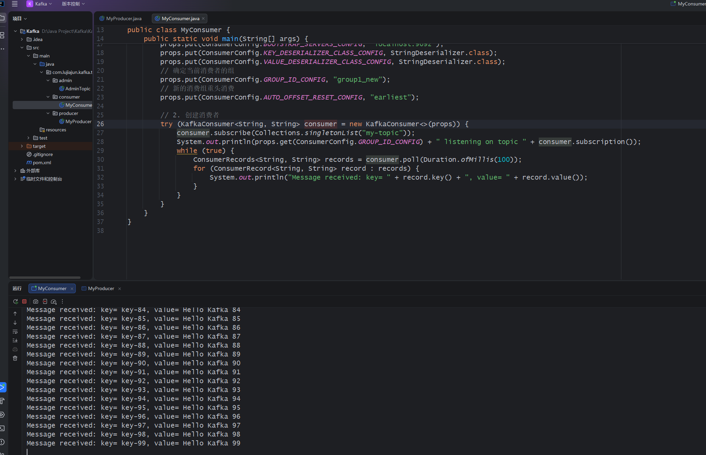

# Kafka使用流程

Kafka是一种分布式、持久化、多副本的持久化日志系统。但平常通常都是作为消息队列来使用。

首先需要运行Kafka进程和Zookeeper进程。

Java中需要添加依赖。

```xml
<dependency>
    <groupId>org.apache.kafka</groupId>
    <artifactId>kafka-clients</artifactId>
    <version>3.6.0</version> 
</dependency>
```

然后需要添加生产者程序。

```java
package com.lujiajun.kafka.test.producer;

import org.apache.kafka.clients.producer.KafkaProducer;
import org.apache.kafka.clients.producer.ProducerConfig;
import org.apache.kafka.clients.producer.ProducerRecord;
import org.apache.kafka.common.serialization.StringSerializer;

import java.util.Properties;

public class MyProducer {
    public static void main(String[] args) {
        // 1. 配置参数
        Properties props = new Properties();
        props.put(ProducerConfig.BOOTSTRAP_SERVERS_CONFIG, "localhost:9092");
        props.put(ProducerConfig.KEY_SERIALIZER_CLASS_CONFIG, StringSerializer.class.getName());
        props.put(ProducerConfig.VALUE_SERIALIZER_CLASS_CONFIG, StringSerializer.class.getName());

        // 2. 创建生产者
        try (KafkaProducer<String, String> producer = new KafkaProducer<>(props)) {
            for (int i = 0; i < 100; i ++) {
                ProducerRecord<String, String> record = new ProducerRecord<>("my-topic", "key-" + i, "Hello Kafka " + i);
                producer.send(record, (metadata, exception) -> {
                    if (exception == null) {
                        System.out.println("Message sent successfully, offset: " + metadata.offset());
                    } else {
                        exception.printStackTrace();
                    }
                });
            }
        }
    }
}
```

> 通过try-with-resources来自动关闭资源。

然后创建消费者进程。

```java
package com.lujiajun.kafka.test.consumer;

import org.apache.kafka.clients.consumer.ConsumerConfig;
import org.apache.kafka.clients.consumer.ConsumerRecord;
import org.apache.kafka.clients.consumer.ConsumerRecords;
import org.apache.kafka.clients.consumer.KafkaConsumer;
import org.apache.kafka.common.serialization.StringDeserializer;

import java.time.Duration;
import java.util.Collections;
import java.util.Properties;

public class MyConsumer {
    public static void main(String[] args) {
        // 1. 配置参数
        Properties props = new Properties();
        props.put(ConsumerConfig.BOOTSTRAP_SERVERS_CONFIG, "localhost:9092");
        props.put(ConsumerConfig.KEY_DESERIALIZER_CLASS_CONFIG, StringDeserializer.class);
        props.put(ConsumerConfig.VALUE_DESERIALIZER_CLASS_CONFIG, StringDeserializer.class);
        // 确定当前消费者的组
        props.put(ConsumerConfig.GROUP_ID_CONFIG, "group1_new");
        // 新的消费组重头消费
        props.put(ConsumerConfig.AUTO_OFFSET_RESET_CONFIG, "earliest");

        // 2. 创建消费者
        try (KafkaConsumer<String, String> consumer = new KafkaConsumer<>(props)) {
            consumer.subscribe(Collections.singletonList("my-topic"));
            System.out.println(props.get(ConsumerConfig.GROUP_ID_CONFIG) + " listening on topic " + consumer.subscription());
            while (true) {
                ConsumerRecords<String, String> records = consumer.poll(Duration.ofMillis(100));
                for (ConsumerRecord<String, String> record : records) {
                    System.out.println("Message received: key= " + record.key() + ", value= " + record.value());
                }
            }
        }
    }
}
```

这样，先启动消费者进程，再启动生产者进程，消费者就能获取到生产者发送的消息。



