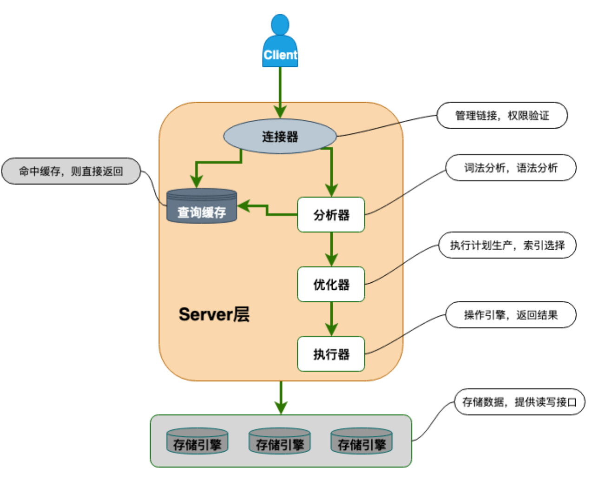

# 1. char和varchar的区别

char定长，存储时剩余的空位会被占用。varchar是变长，第一个字节存储数据长度，随后才存储数据。

# 2. decimal和float与double的区别

float和double是浮点数，只能存储近似的小数值。但decimal是定点数，采用十进制字符串的方式存储，存储对精度有要求的小数值，避免浮点数带来的精度损失。

# 3. datetime和timestamp的区别

datetime没有时区信息，timestamp有时区。

timestamp只需要使用4个字节来存储信息，但datetime需要使用8个字节来存储。但datetime能够存储0000年到9999年的事件，而timestamp在32位系统中只能存储1970到2038年，超出后会出现问题，但64位系统就没问题。而且timestamp可以进行自动的时区转换。

# 4. NULL和''的区别

NULL是缺失或者不确定的结果，而''表示一个存在的空字符串。

NULL不能等于自己，像`NULL = NULL`的结果是NULL不是true或者false，任何值与NULL比较返回的结果都是NULL，表示结果的不确定。而''可以和其他字符串一样比较，结果会返回true或者false。

# 5. MySQL架构图

这里MySQL主要由六个部分组成。

* 连接器。用来身份认证和检查权限。
* 查询缓存。执行查询语句的时候会先看缓存有没有数据。
* 分析器。没有命中缓存时，在分析器中分析SQL的词法和语法。
* 优化器。MySQL自动选择最优的方案执行SQL语句。
* 执行器。执行SQL，从存储引擎中返回数据。
* 插件式存储引擎。负责数据的存储和读取，能够支持多种存储引擎，默认使用InnoDB。

# 6. MySQL索引

MySQL索引是一种用于快速查询的数据结构。索引结构有B树、B+树、红黑树等。但MySQL使用的是B+树。

索引的优点：

1. 提高查询速度。通过索引可以减少扫描的数据量，减少磁盘IO次数。
2. 保证数据的唯一性。创建唯一索引可以保证表中的某一列唯一，如用户ID等，主键本身就是一种唯一索引。
3. 如果查询有ORDER BY等排序字段，索引本身已经排序，所以可以避免额外的排序操作。

索引的缺点：

1. 创建和维护耗时。除了维护数据库，还要额外维护索引表。而对数据进行增删改时，也要维护索引表，降低DML的执行效率。
2. 占用额外空间。索引也是一种数据结构，以物理文件的格式存储，占用一定的空间。
3. 可能会失效。如果查询语句写不好，数据库优化器可能不会使用索引，导致性能下降。

B+树的优势：

1. B+树的特点是高度低。索引树的高度可能只有3-4层，也就是只需3-4次IO就可以查找到数据，而全表扫描可能需要逐个数据来检索。
2. B+树的叶子节点用链表连起来，找到开头后，就能顺着链表顺序一直获取数据。

# 7. 
