# JDBC

## 1.statement

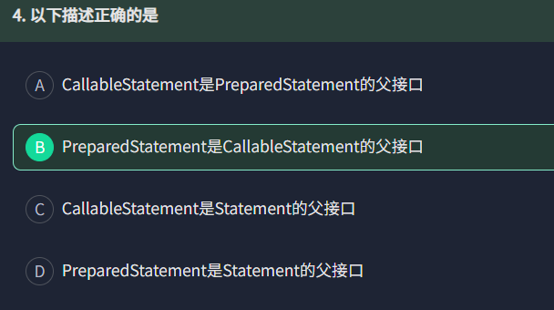

Statement是最基本的接口，PreparedStatement继承自Statement，CallableStatement继承自PreparedStatement接口。

# 锁机制

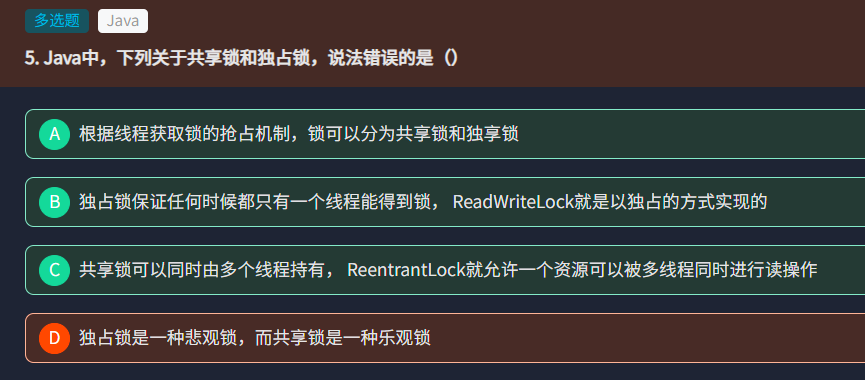

独占锁是悲观锁，共享锁是乐观锁。

# 继承

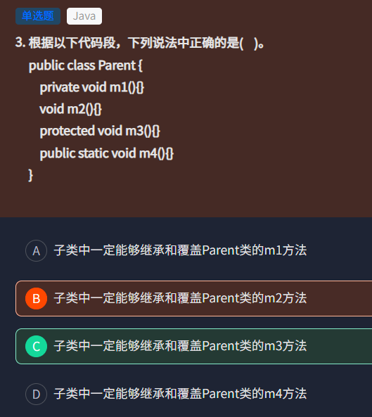

`void m2(){}`中，默认的访问权限是private。而protected能够让子类继承和覆盖，静态方法可以被继承，但不可被覆盖。

# 内存回收

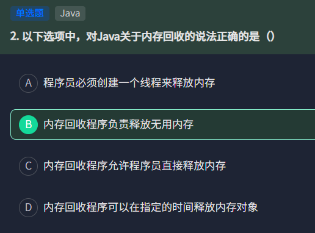

内存回收完全有JVM的垃圾收集器自动完成，且无法指定具体时间释放特定的内存对象。使用`System.gc()`只能进行一次垃圾回收，不保证会回收对象。

# 字符串

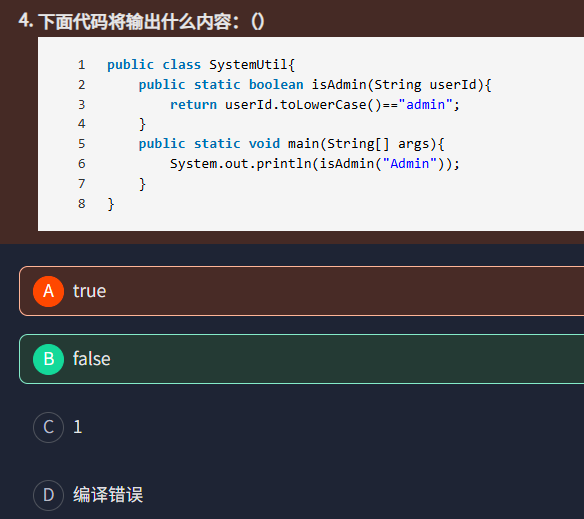

这里的`==`需要密切注意，`toLowerCase()`返回的永远是new出来的对象，放到堆中，与字符串常量池的地址是不一样的。

# JVM

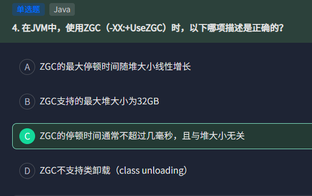

ZGC是低延迟垃圾收集器，将垃圾回收的停顿时间缩小到10毫秒内，无论堆内存多大。它有六个特点。

* 停顿时间不随堆大小、对象情况而增加。
* 支持从8MB到16TB的堆空间。
* 大部分回收阶段与其他线程并行执行。
* 类似G1。
* 使用64位指针来存储元数据。
* 都屏障，线程读取对象的时候，能够保证读取到正确的地址。

# Java包

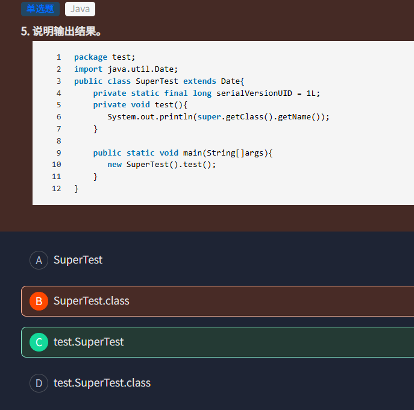

super.getClass和this.getClass一样，获取的都是当前运行类的对象，调用getName时，会返回包名.类名。SuperTest定义在test包下，完整的类名是`test.SuperTest`。

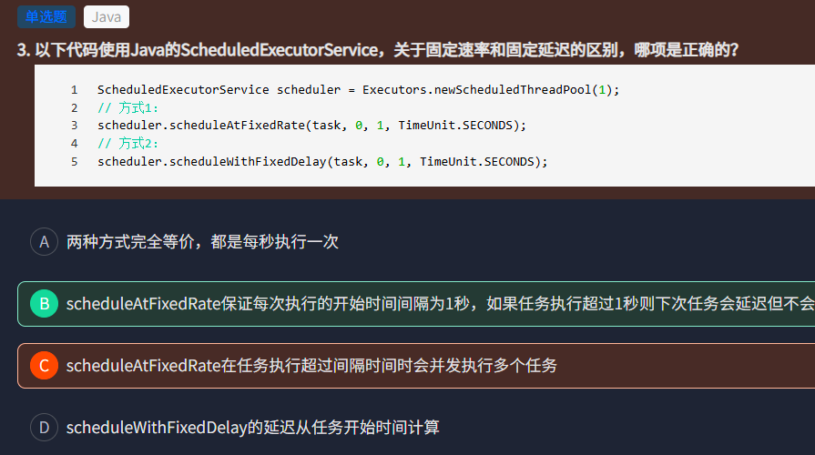

scheduleAtFixedRate(task, initialDelay, period, unit)是根据固定速率来执行任务。理论上任务的开始时间间隔为period，如果任务执行时间小于period，就会按照周期，两次任务的开始时间间隔为1秒。如果执行时间大于period，下次任务就会延迟执行，当前任务执行后，立刻执行下一个任务。

scheduleWithFixedDelay(task, initialDelay, delay, unit)指定了上一次任务执行结束到下一次任务开始的间隔。

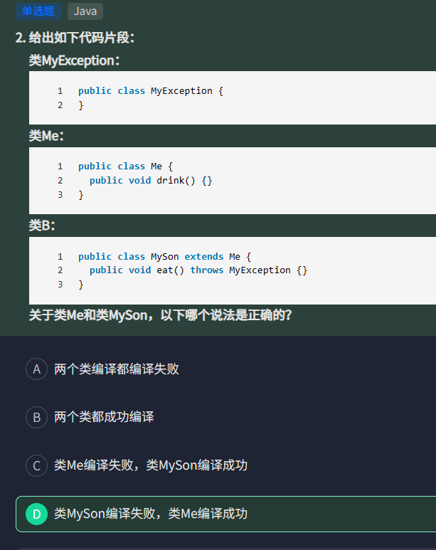

只有继承了Throwable的类才能使用throws。

# 树

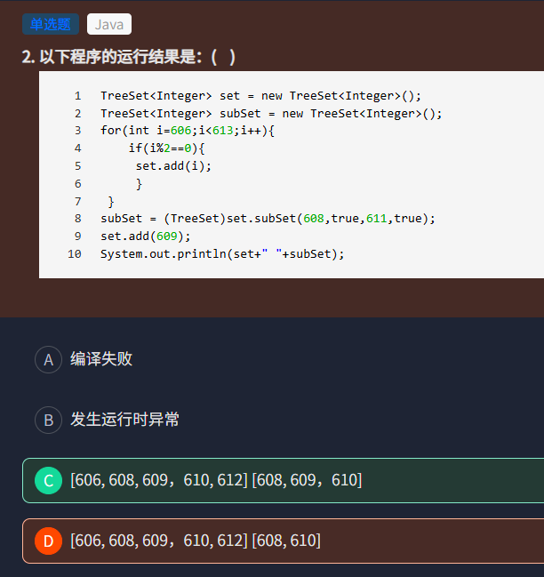

首先606-612的偶数加到set中，set元素为[606, 608, 610, 612]，然后创建自己，包含从608到611的全部元素，所以子集为[608, 610]。set中添加了[609]后，subSet会同步添加[609]。

subSet方法返回的是原集合的视图，两个true分别表示开始元素和结束元素是否为闭区间。

# 集合

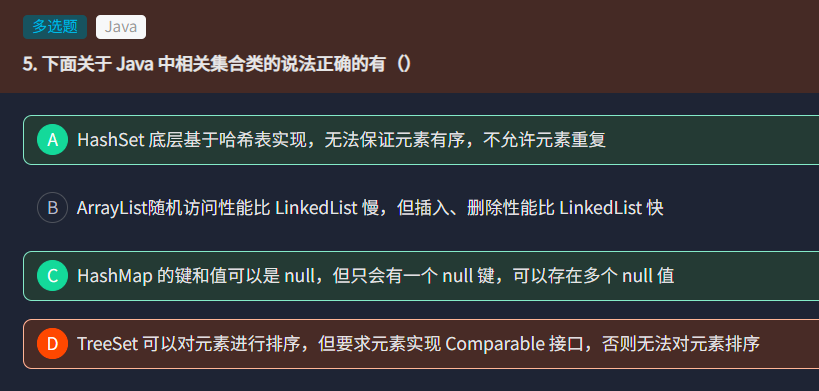

这里TreeSet的排序有两种实现方式。第一种是实现Comparable接口，重写compareTo方法，可以实现排序。或者创建TreeSet是传入Comparator比较器，排序逻辑由Comparator来决定。

# 类

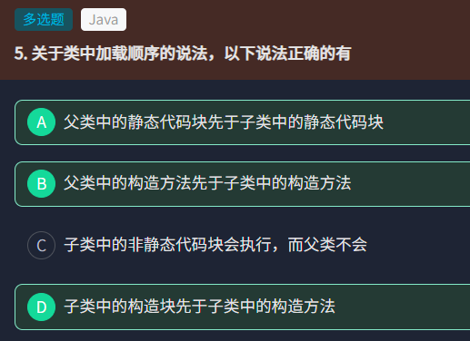

这里存在类的加载原则。`静态代码块->非静态代码块->构造方法`。首先加载父类的静态代码块，然后加载子类的静态代码块，然后说非静态代码块，以此类推，这三部分都是先加载父类，然后加载子类。

# 混合

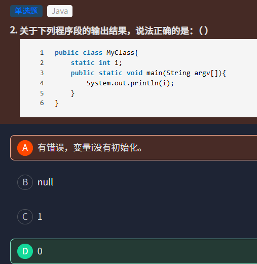

对于基本数据类型，如果是局部变量就需要手动初始化，否则会报错；如果是静态变量或者非静态成员变量，会进行默认初始化。

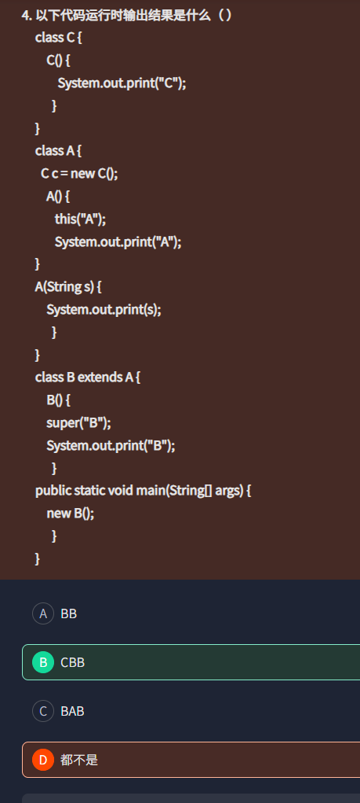

B继承了A，所以需要先初始化A。而又要先初始化类内的成员变量，需要执行C的构造函数，输出C。由于B内的构造函数使用super("B")来运行A的构造函数，因此A初始化时不会自动执行构造函数，而是执行A("B")，输出B。最后再执行B构造函数里的打印，答案就是CBB。

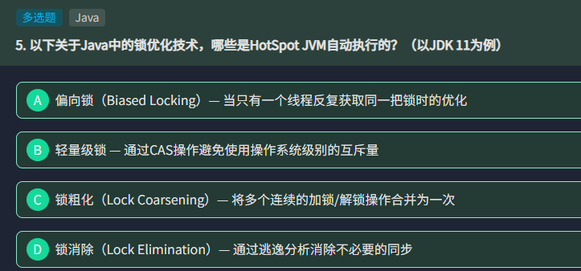

偏向锁在JDK 15之前默认开启，JDK 18被移除。轻量级锁在少量竞争时会使用CAS操作代替重量级锁。锁粗化也会自动进行，减少加解锁次数。缩小出通过逃逸分析发现对象不会逃逸出方法，就会自动消除对象的同步操作。

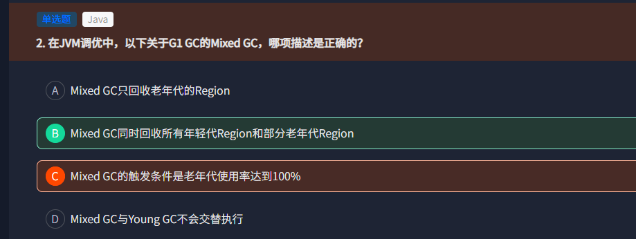

G1的GC有三类。

* Young GC。仅回收所有年轻代Region，当Eden区满时触发。
* Mixed GC。同时回收所有年轻代Region和部分老年代Region，当老年到使用达到阈值时触发。
* Full GC。全部回收，当Mixed GC无法回收足够空间时触发。

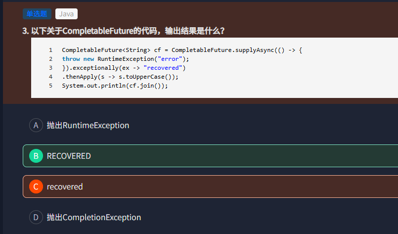

方法内直接抛出异常，通过exceptionally接收后，返回recovered，再通过thenApply来转换为大写。

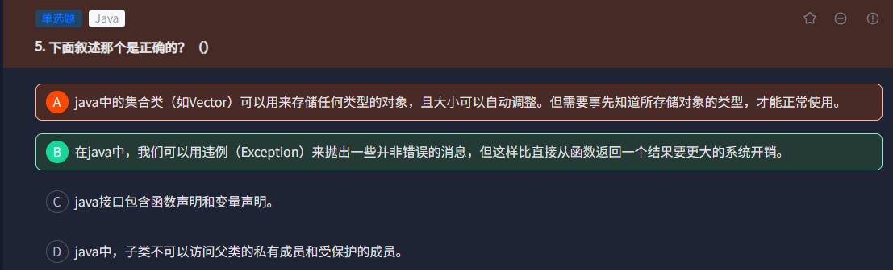

Java集合类能够存储任何类型的对象且不需要知道类型，只需要取出时强制转换即可。异常时处理错误的机制，能够用来传递飞错误的业务消息。但异常的抛出捕获会触发JVM的栈填充、创建异常对象等操作，开销会大于直接返回结果。Java接口只能包含抽象方法声明和常量声明。

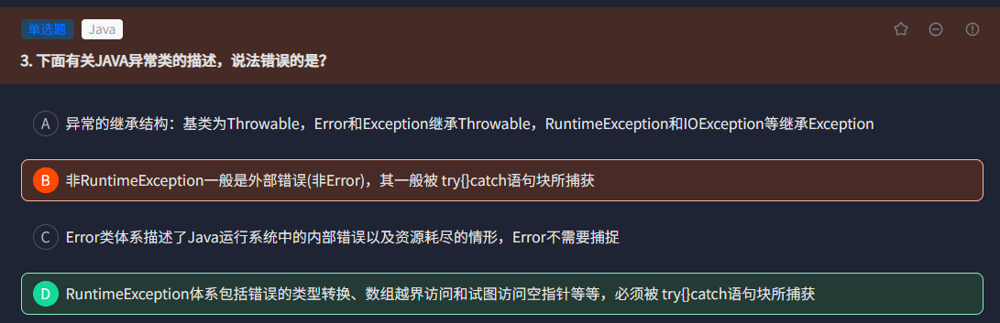

Throwable是所有异常的基类，派生出Error和Exception两大类。

非RuntimeException是受检异常，表示程序外部的错误，如文件读写等，必须显式处理，最好trycatch或者抛出异常。

Error的错误无法恢复，不应该捕获。

RuntimeException是运行时异常，属于程序错误，如数组越界、空指针等，最好修改程序逻辑来避免，而不是依赖异常处理。

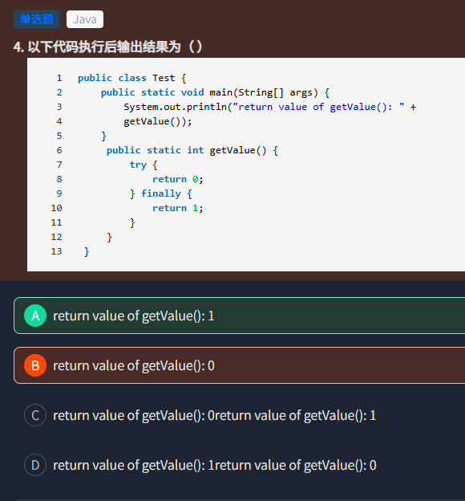

finally的代码必须要执行，即使try中有return，finally的代码会在try的return前执行，并覆盖掉try的return语句。

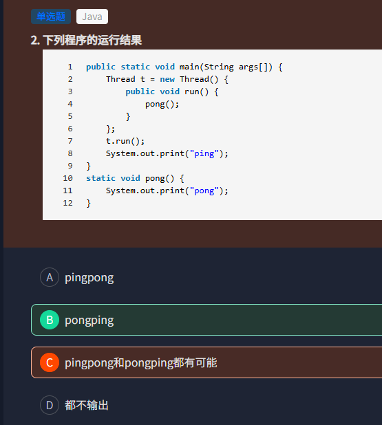

这里`t.run()`表示在主线程main中执行，主线程本身的代码会阻塞。而`t.start()`才是并发执行。

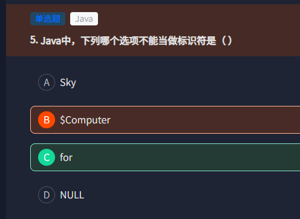

这里标识符是命名规则，for不能做标识符，而NULL允许，但不建议。